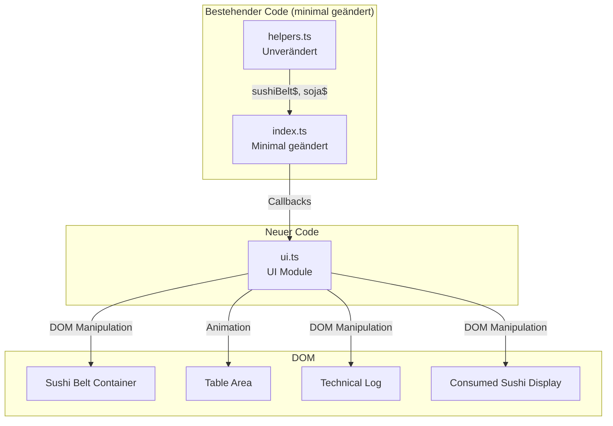
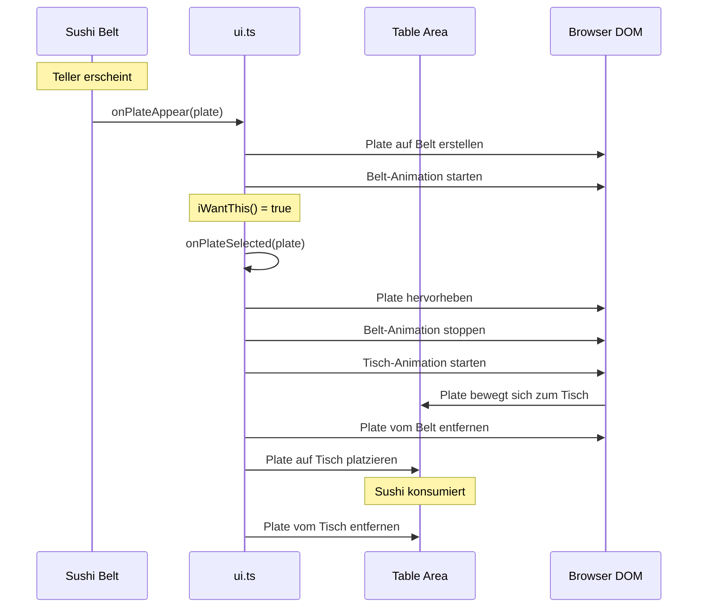
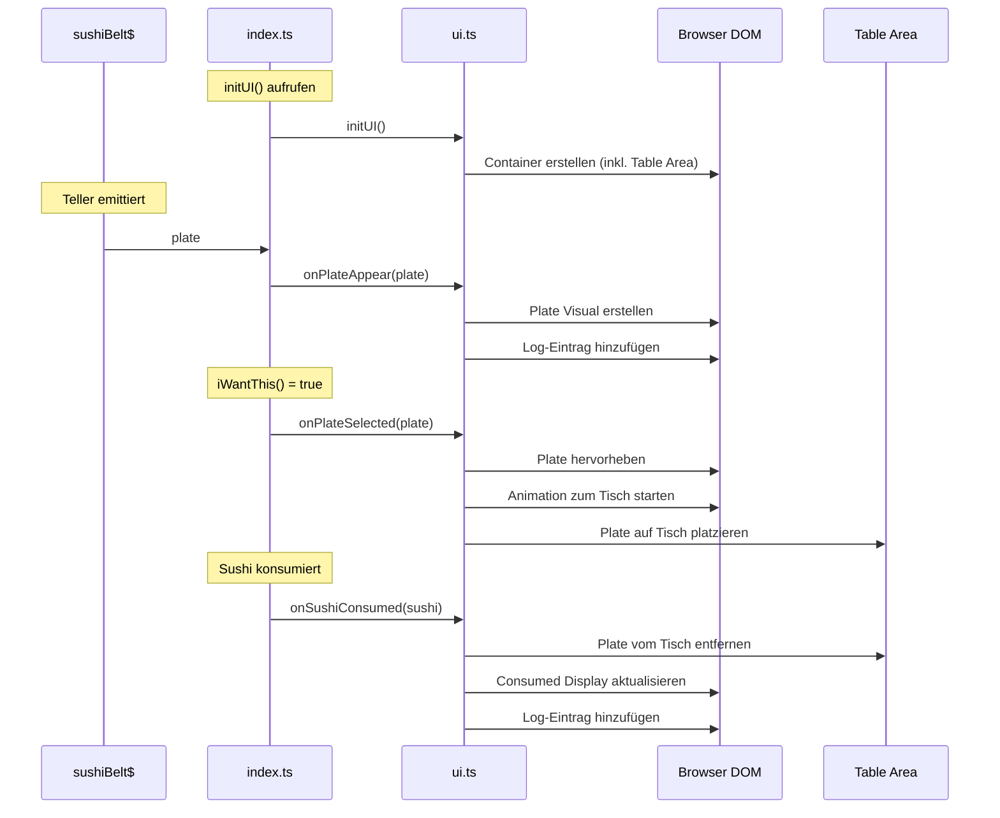

# Design Document: Sushi UI Visualization

## Übersicht

Dieses Design beschreibt die Implementierung einer visuellen UI-Darstellung für das RxJS Sushi-Belt-Demo. Die Lösung ersetzt die Konsolen-Ausgaben durch eine animierte Visualisierung eines Running-Sushi-Bandes mit einem parallelen technischen Log.

Die Architektur folgt dem Prinzip der minimalen Änderung: Eine neue `ui.ts` Datei stellt alle UI-Funktionen bereit, während `helpers.ts` unverändert bleibt und `index.ts` nur minimale Anpassungen erhält.

**Neu:** Ausgewählte Teller (iWantThis = true) werden vom Sushi-Band zu einem Tisch-Bereich animiert, wo sie verbleiben bis das Sushi konsumiert wird.

## Architektur



### Teller-Animation-Flow



### Datenfluss



## Komponenten und Schnittstellen

### UI Module (ui.ts)

Das UI-Modul exportiert folgende Funktionen:

```typescript
// Initialisierung - erstellt alle DOM-Container
export function initUI(): void;

// Callback wenn ein Teller auf dem Band erscheint
export function onPlateAppear(plate: Plate): void;

// Callback wenn ein Teller ausgewählt wird (iWantThis = true)
// Startet Animation vom Band zum Tisch
export function onPlateSelected(plate: Plate): void;

// Callback wenn Sushi konsumiert wird
// Entfernt den Teller vom Tisch
export function onSushiConsumed(sushi: SushiWithSoja): void;

// Callback für Start-Event
export function onStart(): void;

// Callback für Stop-Event
export function onStop(): void;

// Log-Funktion für technische Ausgaben
export function logToUI(message: string, type?: 'info' | 'success' | 'warning'): void;
```

### DOM-Struktur

```html
<div id="sushi-app">
  <!-- Sushi Belt Bereich -->
  <div id="sushi-belt-container">
    <div id="sushi-belt">
      <!-- Animierte Plate Visuals werden hier eingefügt -->
      <div class="plate-visual" data-plate-id="1">
        <span class="plate-id">#1</span>
        <span class="plate-contents">🍣 A A A</span>
      </div>
    </div>
  </div>

  <!-- Tisch-Bereich für ausgewählte Teller -->
  <div id="table-area">
    <h3>🪑 Mein Tisch</h3>
    <div id="table-surface">
      <!-- Ausgewählte Teller landen hier -->
      <div class="plate-visual on-table" data-plate-id="1">
        <span class="plate-id">#1</span>
        <span class="plate-contents">🍣 A A A</span>
      </div>
    </div>
  </div>

  <!-- Unterer Bereich: Log und Consumed Display nebeneinander -->
  <div id="bottom-section">
    <!-- Technischer Log -->
    <div id="technical-log">
      <h3>📋 Technischer Log</h3>
      <div id="log-entries">
        <!-- Log-Einträge werden hier eingefügt -->
        <div class="log-entry info">🍽 Teller 1: A, A, A</div>
      </div>
    </div>

    <!-- Konsumiertes Sushi -->
    <div id="consumed-sushi">
      <h3>🍱 Konsumiert</h3>
      <div id="consumed-entries">
        <!-- Konsumierte Sushi werden hier angezeigt -->
        <div class="consumed-item">🍣 A 1 + 🫘</div>
      </div>
    </div>
  </div>
</div>
```

### CSS-Klassen

| Klasse | Beschreibung |
|--------|--------------|
| `.plate-visual` | Basis-Styling für einen Teller auf dem Band |
| `.plate-visual.selected` | Hervorgehobener Teller (wurde ausgewählt) |
| `.plate-visual.animate` | Aktiviert die Slide-Animation auf dem Band |
| `.plate-visual.moving-to-table` | Aktiviert die Animation vom Band zum Tisch |
| `.plate-visual.on-table` | Teller ist auf dem Tisch platziert |
| `#table-area` | Container für den Tisch-Bereich |
| `#table-surface` | Die Tischoberfläche mit Holz-Textur |
| `.log-entry` | Basis-Styling für Log-Einträge |
| `.log-entry.info` | Info-Nachricht (blau) |
| `.log-entry.success` | Erfolg-Nachricht (grün) |
| `.log-entry.warning` | Warnung-Nachricht (orange) |
| `.consumed-item` | Styling für konsumiertes Sushi |

## Datenmodelle

### Plate Visual State

```typescript
interface PlateVisualState {
  plateId: number;
  element: HTMLElement;
  isSelected: boolean;
  isOnTable: boolean;
  animationTimeout: number | null;
}

// Map zur Verwaltung aller aktiven Plate Visuals
const activePlates: Map<number, PlateVisualState> = new Map();

// Map zur Verwaltung der Teller auf dem Tisch
const tablePlates: Map<number, PlateVisualState> = new Map();
```

### Log Entry

```typescript
interface LogEntry {
  timestamp: Date;
  message: string;
  type: 'info' | 'success' | 'warning';
}
```

### Konfiguration

```typescript
const UI_CONFIG = {
  // Animation
  BELT_ANIMATION_DURATION: 8000,  // ms für komplette Durchfahrt
  PLATE_SPAWN_POSITION: -150,     // px vom linken Rand
  TABLE_ANIMATION_DURATION: 500,  // ms für Animation zum Tisch

  // Log
  MAX_LOG_ENTRIES: 50,

  // Sushi Emojis
  SUSHI_EMOJI: {
    'A': '🍣',
    'B': '🍙',
    'C': '🥟'
  } as Record<string, string>,

  SOJA_EMOJI: '🫘'
};
```

### Tisch-Animation Implementierung

Die Animation vom Band zum Tisch verwendet CSS-Transitions mit dynamisch berechneten Positionen:

```typescript
function animatePlateToTable(plateState: PlateVisualState): void {
  const plateElement = plateState.element;
  const tableArea = document.getElementById('table-surface');

  // Aktuelle Position des Tellers auf dem Band ermitteln
  const plateRect = plateElement.getBoundingClientRect();
  const tableRect = tableArea.getBoundingClientRect();

  // Zielposition auf dem Tisch berechnen
  const targetX = tableRect.left + (tablePlates.size * 80); // Teller nebeneinander
  const targetY = tableRect.top + 20;

  // CSS-Klasse für Animation hinzufügen
  plateElement.classList.add('moving-to-table');
  plateElement.style.setProperty('--target-x', `${targetX - plateRect.left}px`);
  plateElement.style.setProperty('--target-y', `${targetY - plateRect.top}px`);

  // Nach Animation: Teller vom Band entfernen und auf Tisch platzieren
  setTimeout(() => {
    // Neues Element für den Tisch erstellen
    const tablePlate = createTablePlateElement(plateState);
    tableArea.appendChild(tablePlate);
    tablePlates.set(plateState.plateId, { ...plateState, element: tablePlate, isOnTable: true });

    // Original vom Band entfernen
    plateElement.remove();
    activePlates.delete(plateState.plateId);
  }, UI_CONFIG.TABLE_ANIMATION_DURATION);
}
```

## Correctness Properties

*Eine Property ist eine Eigenschaft oder ein Verhalten, das für alle gültigen Ausführungen eines Systems gelten sollte – im Wesentlichen eine formale Aussage darüber, was das System tun soll. Properties dienen als Brücke zwischen menschenlesbaren Spezifikationen und maschinenverifizierbaren Korrektheitsgarantien.*

### Property 1: Plate Rendering Completeness

*Für jeden* Teller, der an `onPlateAppear()` übergeben wird, soll ein DOM-Element erstellt werden, das die Teller-ID und alle Sushi-Inhalte korrekt anzeigt.

**Validates: Requirements 1.2, 1.5**

### Property 2: Plate Selection Visual Feedback

*Für jeden* Teller, der an `onPlateSelected()` übergeben wird, soll das entsprechende DOM-Element die CSS-Klasse "selected" erhalten. Teller, die nicht ausgewählt werden, sollen diese Klasse nicht haben.

**Validates: Requirements 2.1, 2.2**

### Property 3: Log Entry Creation

*Für jedes* Event (Teller erscheint, Teller ausgewählt, Sushi konsumiert), soll ein entsprechender Log-Eintrag im Technical_Log erstellt werden, der die relevanten Informationen enthält.

**Validates: Requirements 2.3, 3.2, 3.3**

### Property 4: Log Entry Limit Invariant

*Für alle* Zustände des Technical_Log soll die Anzahl der Log-Einträge niemals 50 überschreiten. Wenn ein neuer Eintrag hinzugefügt wird und bereits 50 Einträge existieren, soll der älteste Eintrag entfernt werden.

**Validates: Requirements 3.7**

### Property 5: Plate Animation Lifecycle

*Für jeden* Teller, der auf dem Band erscheint, soll die Animation gestartet werden und nach Ablauf der Animation-Dauer soll das DOM-Element automatisch entfernt werden.

**Validates: Requirements 1.3, 1.4**

### Property 6: Consumed Sushi Rendering

*Für jedes* Sushi mit Soja, das an `onSushiConsumed()` übergeben wird, soll ein DOM-Element erstellt werden, das den Sushi-Typ, die Teller-ID und das Soja-Symbol enthält.

**Validates: Requirements 4.1, 4.2**

### Property 7: Auto-Scroll Behavior

*Für jeden* neuen Log-Eintrag soll der Technical_Log automatisch zum neuesten Eintrag scrollen, sodass dieser sichtbar ist.

**Validates: Requirements 3.6**

### Property 8: Plate-to-Table Animation Trigger

*Für jeden* Teller, der an `onPlateSelected()` übergeben wird, soll eine Animation zum Tisch gestartet werden. Das Element soll die CSS-Klasse "moving-to-table" erhalten und die Animation-Properties sollen gesetzt werden.

**Validates: Requirements 2.4**

### Property 9: Plate Transfer Completeness

*Für jeden* Teller, der zum Tisch animiert wird, soll nach Abschluss der Animation das Element vom Sushi-Band entfernt werden UND ein entsprechendes Element auf dem Table_Area platziert werden.

**Validates: Requirements 2.5, 8.3**

### Property 10: Table Plate Lifecycle

*Für jeden* Teller auf dem Table_Area soll dieser dort verbleiben bis `onSushiConsumed()` mit dem entsprechenden Sushi aufgerufen wird. Nach dem Konsum soll der Teller vom Tisch entfernt werden.

**Validates: Requirements 2.6, 8.5**

### Property 11: Multiple Plates on Table Invariant

*Für alle* Zustände des Table_Area soll es möglich sein, mehrere Teller gleichzeitig anzuzeigen. Jeder Teller soll sichtbar und unterscheidbar sein.

**Validates: Requirements 8.4**

## Error Handling

### DOM-Element nicht gefunden

Wenn ein erforderliches DOM-Element nicht gefunden wird, soll eine Warnung in der Konsole ausgegeben werden und die Funktion soll graceful fehlschlagen (keine Exception werfen).

```typescript
function getElement(id: string): HTMLElement | null {
  const element = document.getElementById(id);
  if (!element) {
    console.warn(`[UI] Element #${id} nicht gefunden`);
  }
  return element;
}
```

### Ungültige Plate-ID

Wenn `onPlateSelected()` mit einer Plate-ID aufgerufen wird, für die kein Visual existiert, soll die Funktion ohne Fehler zurückkehren.

### Animation-Cleanup

Wenn das Band gestoppt wird, sollen alle laufenden Animationen und Timeouts bereinigt werden, um Memory Leaks zu vermeiden.

### Tisch-Animation bei fehlendem Teller

Wenn `onPlateSelected()` aufgerufen wird, aber der Teller bereits vom Band entfernt wurde (z.B. durch Timeout), soll die Funktion graceful fehlschlagen und einen Warn-Log ausgeben.

### Konsum ohne Teller auf Tisch

Wenn `onSushiConsumed()` aufgerufen wird, aber kein entsprechender Teller auf dem Tisch liegt, soll die Funktion trotzdem das Consumed-Display aktualisieren und einen Info-Log ausgeben.

## Testing Strategy

### Unit Tests

Unit Tests sollen folgende spezifische Szenarien abdecken:

1. **initUI()**: Prüfen, dass alle DOM-Container erstellt werden
2. **onStart()/onStop()**: Prüfen, dass die korrekten Log-Nachrichten erscheinen
3. **Edge Cases**: Leere Teller-Inhalte, sehr lange Teller-IDs

### Property-Based Tests

Property-Based Tests werden mit **fast-check** implementiert und sollen mindestens 100 Iterationen pro Test durchführen.

Jeder Property-Test soll mit einem Kommentar annotiert werden:
```typescript
// Feature: sushi-ui-visualization, Property N: [Property Title]
```

### Test-Konfiguration

```typescript
import fc from 'fast-check';

// Arbitrary für Plate
const plateArbitrary = fc.record({
  id: fc.integer({ min: 0, max: 10000 }),
  contents: fc.array(fc.constantFrom('A', 'B', 'C'), { minLength: 1, maxLength: 5 })
});

// Arbitrary für SushiWithSoja
const sushiWithSojaArbitrary = fc.tuple(
  fc.stringOf(fc.constantFrom('A', 'B', 'C'), { minLength: 1, maxLength: 3 }),
  fc.constant('SOJA' as const)
);
```

### Testbare vs. Nicht-Testbare Anforderungen

| Anforderung | Testbar | Grund |
|-------------|---------|-------|
| 1.2, 1.5, 2.1, 2.2 | Ja - Property | DOM-Manipulation verifizierbar |
| 2.4, 2.5, 2.6 | Ja - Property | Animation und DOM-State verifizierbar |
| 3.7 | Ja - Property | Invariante prüfbar |
| 4.1, 4.2 | Ja - Property | Rendering verifizierbar |
| 5.1, 5.3, 5.4 | Nein | Code-Struktur, nicht funktional |
| 6.4, 7.3 | Nein | Subjektive visuelle Kriterien |
| 8.1, 8.3, 8.4, 8.5 | Ja - Property | DOM-State verifizierbar |
| 8.2 | Nein | Subjektives visuelles Design |

